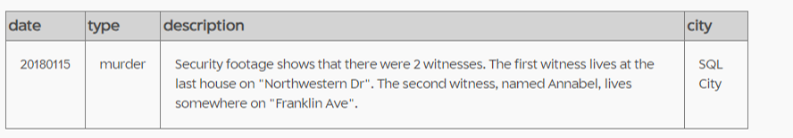
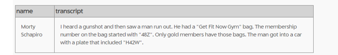
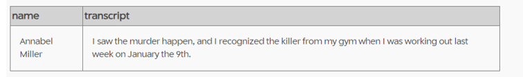
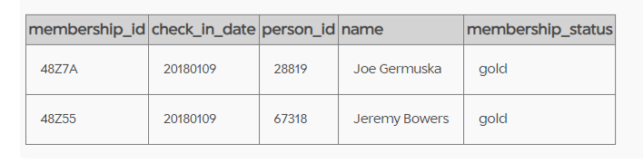
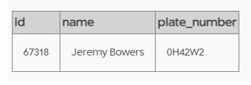
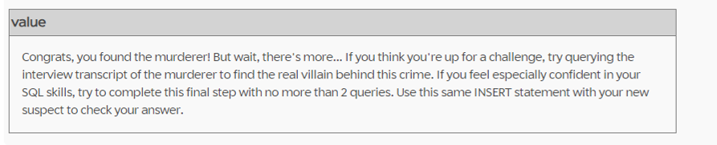
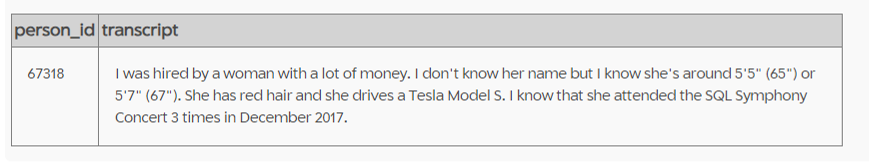
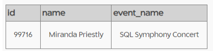
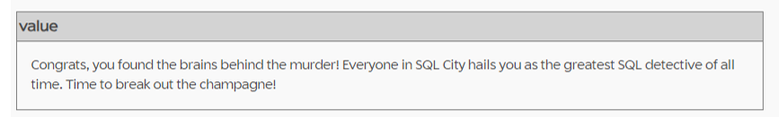

# SQL Murder Mystery

This repository showcases the sql prompts I used to solve the infamous "SQL Murder Mystery" exercise.

<div align='center'>
  
</div>

## About the excercise

The SQL Murder Mystery exercise is intended primarily as a way to practice SQL skills and was created by Joon Park and Cathy He while they were Knight Lab fellows.
Find the original repository [here](https://github.com/NUKnightLab/sql-mysteries):
It was adapted and produced for the web by Joe Germuska. Link to the exercise: https://mystery.knightlab.com

### **TASK**

A crime has taken place and the detective needs your help. The detective gave you the crime scene report, but you somehow lost it. You vaguely remember that the crime was a murder that occurred sometime on Jan.15, 2018 and that it took place in SQL City. Start by retrieving the corresponding crime scene report from the police department’s database.

### **SQL Techniques Used**

- Queries with constraints (WHERE, AND/OR, IN, BETWEEN, LIKE, etc.)
- Filtering and Sorting Query (e.g. ORDER BY, and LIMIT)
- Table Joins

## Solution

### **1. Finding the crime in crime_scene_report**

To get started, we know that the "murder" took place on "Jan 15 2018" in "SQL City". Use these conditions to filter the crime report.

```

    SELECT *
      FROM Crime_scene_report
        WHERE date = '20180115'
        AND city = 'SQL City'
      ;
```

  

This gives us clues of 2 witnesses.

### **2. Finding the First witness and his/her interview transcript**

First witness lives on the last house of Northwestern Dr. Using these conditions and joining person table with interview table, we can find the name and trasncript of first witness.

```
    SELECT name, transcript
      FROM person
        INNER JOIN interview
        ON id = person_id
          WHERE address_street_name = "Northwestern Dr"
            ORDER BY address_number desc
            LIMIT 1
      ;
```

  

### **3. Finding the Second witness and his/her interview transcript**

We have first name and address of second witness. Using these conditions and joining person table with interview table, we can find the name and trasncript of Second witness.

```
    SELECT name, transcript
      FROM person
        INNER JOIN interview
        ON id = person_id
          WHERE address_street_name = "Franklin Ave"
          AND name LIKE "Annabel%"
      ;
```

  

### **4. Finding the person with Get Fit Now Gold membership**

From the two transcripts we know that the killer had "Gold" membership with id strating from 48Z. Using these conditions and joining get_fit_now_member table with get_fit_now_check_in table we can narrow our search to few people.

```
    SELECT membership_id, check_in_date, person_id, name, membership_status
      FROM get_fit_now_member
        INNER JOIN get_fit_now_check_in
        ON id = membership_id
          WHERE membership_status = "gold"
          AND membership_id LIKE "48Z%"
      ;
```

  

### **5. Finding the KILLER**

We now have 2 suspects and part of the Killer's plate number. Using these conditions and joining person table with drivers_license table we get our "KILLER".

```
    SELECT person.id, name, plate_number
      FROM person
        JOIN Drivers_license
        ON person.license_id = Drivers_license.id
          WHERE name IN ("Joe Germuska", "Jeremy Bowers")
          AND plate_number LIKE "%H42W%"
      ;
```

**Spolier Alert !!**





### **6. Finding the MASTERMIND**

Looks like there is someone else behind the crime.

To find the mastermind, first let's look at the transcript of the Killer.

```
    SELECT *
      FROM interview
        WHERE person_id = 67318
      ;
```

  

Clues in his statement:
Gender = Female; Hair colour =Red, Height = Between 65 and 67, Car make = Tesla' and Car model = Model S, Event attended = SQL Symphoy Concert
Use these clues and Joining drivers_license, person and facebook_event_checkin table, we find our "MASTERMIND"

```
    SELECT
      DISTINCT person.name, person.id, person.license_id
        FROM drivers_license
          INNER JOIN person
          ON Drivers_license.id = person.license_id
              INNER JOIN facebook_event_checkin
              ON person.id = facebook_event_checkin.person_id
                      WHERE gender = 'female'
                      AND hair_color = 'red'
                      AND car_make = 'Tesla'
                      AND car_model ='Model S'
                      AND height Between 65 AND 67
        ;
```

**Spolier Alert !!**





Our SQL Skill has solved another crime!!!!
